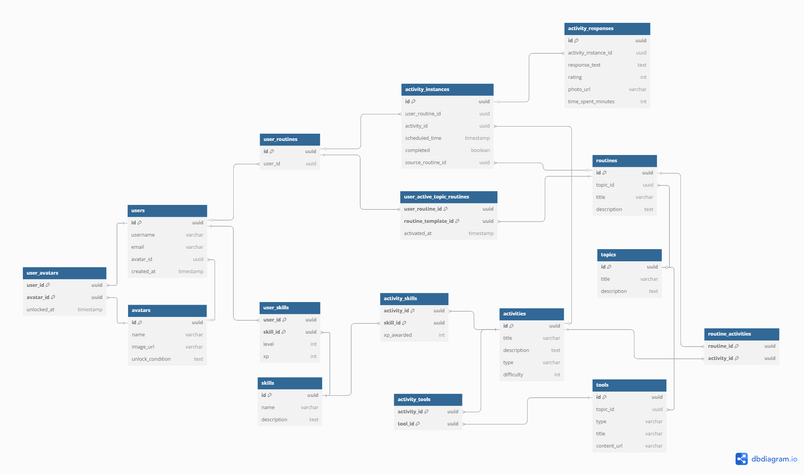

# ERD/Table Glossary

This document explains the purpose and structure of each table in the app's database schema. It complements the following DBML diagram, created using `dbdiagram.io`:

---

 

## 👤 users
Represents an authenticated user in the app.

| Field        | Type   | Description                        |
|--------------|--------|------------------------------------|
| id           | UUID   | Primary key                        |
| username     | String | Display name                       |
| email        | String | User's email                       |
| avatar_id    | UUID   | Currently selected avatar          |
| created_at   | Timestamp | When the account was created  |

---

 

## 🎭 avatars
Selectable profile icons for users.

| Field        | Type   | Description                            |
|--------------|--------|----------------------------------------|
| id           | UUID   | Primary key                            |
| name         | String | Avatar name                            |
| image_url    | String | URL to the avatar image                |
| unlock_condition | Text | Description of how to unlock it      |

---

 

## 🎨 user_avatars
Join table for users and the avatars they've unlocked.

| Field        | Type   | Description                            |
|--------------|--------|----------------------------------------|
| user_id      | UUID   | Linked to `users.id` (primary key)     |
| avatar_id    | UUID   | Linked to `avatars.id` (primary key)   |
| unlocked_at  | Timestamp | When the avatar was unlocked       |

---

 

## 🧠 skills
Trackable competencies (e.g., Sleep, Nutrition).

| Field        | Type   | Description                    |
|--------------|--------|--------------------------------|
| id           | UUID   | Primary key                    |
| name         | String | Skill name                     |
| description  | Text   | What the skill represents      |

---

 

## 📈 user_skills
User’s progress for each skill.

| Field        | Type   | Description                    |
|--------------|--------|--------------------------------|
| user_id      | UUID   | Linked to `users.id` (PK)      |
| skill_id     | UUID   | Linked to `skills.id` (PK)     |
| level        | Int    | Skill level                    |
| xp           | Int    | XP points earned               |

---

 

## 🗂️ topics
Thematic areas of self-help (e.g., Sleep, Mindfulness).

| Field        | Type   | Description                    |
|--------------|--------|--------------------------------|
| id           | UUID   | Primary key                    |
| title        | String | Name of the topic              |
| description  | Text   | Overview of the topic          |

---

 

## 🧰 tools
Learning or support content within a topic.

| Field        | Type   | Description                    |
|--------------|--------|--------------------------------|
| id           | UUID   | Primary key                    |
| topic_id     | UUID   | Linked to `topics.id`          |
| type         | String | Enum: PODCAST, GUIDE, MUSIC    |
| title        | String | Title of the tool              |
| content_url  | String | Link to resource               |

---

 

## 🔁 routines
Template routines under a topic (e.g., "Healthy Sleep Routine").

| Field        | Type   | Description                    |
|--------------|--------|--------------------------------|
| id           | UUID   | Primary key                    |
| topic_id     | UUID   | Linked to `topics.id`          |
| title        | String | Routine name                   |
| description  | Text   | What it includes               |

---

 

## 🧩 activities
Reusable tasks (e.g., “Journal for 5 minutes”).

| Field        | Type   | Description                    |
|--------------|--------|--------------------------------|
| id           | UUID   | Primary key                    |
| title        | String | Task title                     |
| description  | Text   | Task instructions              |
| type         | String | TIME_BASED, TEXT, RATING, etc. |
| difficulty   | Int    | Optional difficulty level      |

---

 

## 🔗 routine_activities
Join table between routines and their activities.

| Field        | Type   | Description                    |
|--------------|--------|--------------------------------|
| routine_id   | UUID   | Linked to `routines.id` (PK)   |
| activity_id  | UUID   | Linked to `activities.id` (PK) |

---

 

## 🔧 activity_tools
Optional links between activities and tools they use.

| Field        | Type   | Description                    |
|--------------|--------|--------------------------------|
| activity_id  | UUID   | Linked to `activities.id` (PK) |
| tool_id      | UUID   | Linked to `tools.id` (PK)      |

---

 

## 🎯 activity_skills
Defines which skills an activity improves and by how much.

| Field        | Type   | Description                    |
|--------------|--------|--------------------------------|
| activity_id  | UUID   | Linked to `activities.id` (PK) |
| skill_id     | UUID   | Linked to `skills.id` (PK)     |
| xp_awarded   | Int    | XP earned when completed       |

---

 

## 📅 user_routines
Each user has one personal routine (their calendar).

| Field        | Type   | Description                    |
|--------------|--------|--------------------------------|
| id           | UUID   | Primary key                    |
| user_id      | UUID   | Linked to `users.id`           |

---

 

## ✅ user_active_topic_routines
Tracks which topic-based routines a user has activated.

| Field               | Type   | Description                    |
|---------------------|--------|--------------------------------|
| user_routine_id     | UUID   | Linked to `user_routines.id` (PK) |
| routine_template_id | UUID   | Linked to `routines.id` (PK)      |
| activated_at        | Timestamp | When it was activated       |

---

 

## ⏱ activity_instances
Scheduled and personalized copies of activities.

| Field              | Type   | Description                            |
|--------------------|--------|----------------------------------------|
| id                 | UUID   | Primary key                            |
| user_routine_id    | UUID   | Linked to `user_routines.id`           |
| activity_id        | UUID   | Linked to `activities.id`              |
| scheduled_time     | Timestamp | When it’s scheduled                 |
| completed          | Boolean | Whether the task was completed        |
| source_routine_id  | UUID   | Linked to `routines.id` (optional)     |

---

 

## 📝 activity_responses
Stores user input or proof for each activity.

| Field               | Type   | Description                            |
|---------------------|--------|----------------------------------------|
| id                  | UUID   | Primary key                            |
| activity_instance_id| UUID   | Linked to `activity_instances.id`      |
| response_text       | Text   | Notes or journaling content            |
| rating              | Int    | User’s rating                          |
| photo_url           | String | Link to uploaded photo (if required)   |
| time_spent_minutes  | Int    | Time spent on the activity             |

---